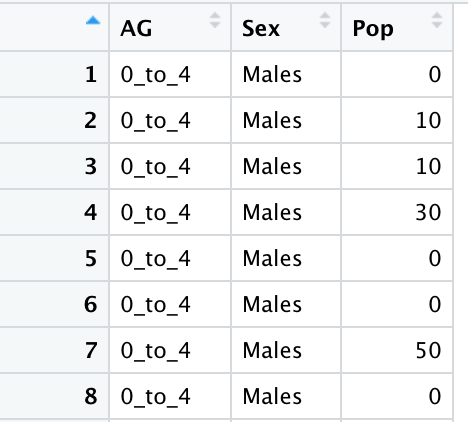
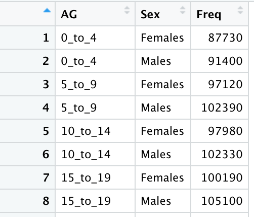
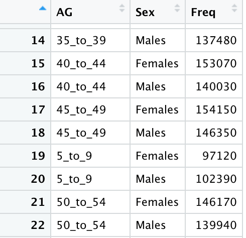
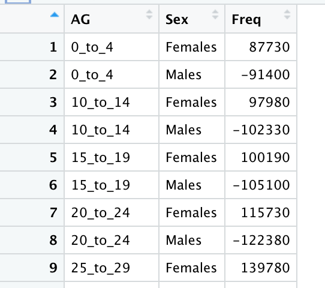

```{r setup, include=FALSE}
knitr::opts_chunk$set(echo = TRUE,
                      fig.retina = 5,
                      warning = FALSE)
```

# 1.0 Introduction
This take-home exercise aims to apply the skills learnt to create: 
+ a pareto chart showing the distribution of returns by product sub-category
+ a age-sex pyramid showing the demographic structure of Singapore by age cohort and gender.

**A Pareto chart** is a type of chart that contains both bars and a line graph, where individual values are represented in descending order by bars, and the cumulative total is represented by the line. The left vertical axis is the frequency of occurrence, but it can alternatively represent cost or another important unit of measure. The right vertical axis is the cumulative percentage of the total number of occurrences, total cost, or total of the particular unit of measure. In market share study, Pareto charts are useful to reveal if the business is dominated by a handful of key products or customers.

**A Population Pyramid or "Age-Sex Pyramid"** is a graphical illustration of the distribution of a population (typically that of a country or region of the world) by age groups and sex; it typically takes the shape of a pyramid when the population is growing. Males are usually shown on the left and females on the right, and they may be measured in absolute numbers or as a percentage of the total population. 

Before processing to the next step, please use the code chunk below to **install and launch the required packages** in RStudio.

```{r}
packages = c('tidyverse', 'readxl', 'knitr')

for(p in packages){
  if(!require(p, character.only = T)){
    install.packages(p)
  }
  library(p, character.only = T)
}
```


# 2.0 Pareto Chart
## Importing Data
In this exercise, superstore-2021 data set, an MS Excel workbook will be used. It consists of three worksheets, namely: Orders, People and Returns. First, import the data into R by using read_xls() of readr package.

```{r}
orders <- read_xls("Data/Superstore-2021.xls",
                  sheet = "Orders")
returns <- read_xls("Data/Superstore-2021.xls",
                  sheet = "Returns")
```

## Data Preparation
### Joining two dataframes
In order to produce a Pareto Chart which contains information on frequency of returns, we need to employee  **left_join() of dplyr** to join the 'Orders' and 'Returns' worksheets by using **Order ID** as a unique identifier.

```{r}
joined_tab <- left_join(returns, orders,
                        by = c('Order ID' = 'Order ID'))
```
 
### Count frequency of returns by sub-category using gtoup-by method
To achieve this, we need to use **group-by()** of dplyr package to group the data set by sub-category and **summarise()** to count the frequency of returns (i.e. n()) for each sub-category, a new dataframe named 'freq_returned' would be created to store the name of sub-categories and their respective number of returns. Please always remember to **ungroup()** after using groupby() as orelse you cannot performance any operations on the grouping variables, meaning they can't be mutated or summarized.

```{r}
freq_returned <- joined_tab %>%
  group_by(`Sub-Category`) %>%
  summarise('Returns' = n()) %>%
  ungroup()
```

### Sorting data and Computing cumulative frequency
By default, the resultant 'freq-returned' data frame is sorted by values of first column, in this case, the alphabetical order of 'sub-category' field. To plot a Pareto chart, we need to rearrange the order by sorting the data frame in a descending order of count of returns. To achieve this, we need to use the **arrange()** of dplyr package.

```{r}
freq_sorted <- freq_returned %>%
  arrange(desc(Returns))
```

To compute the **cumulative frequency** of returns, we need to use **mutate()** of dplyr package and **cumsum()** of Base R.   **mutate()** adds a new variable 'cumfreq' while preserving existing ones and **cumsum()** returns a cumulative sums vector to the 'cumfreq' field.

```{r}
freq_cum <- freq_sorted %>%
  mutate(cumfreq = cumsum(Returns))
```

## Plotting of Graph using ggplot2

To plot a Pareto chart:  
1. Use **ggplot function** to specify the data and the aesthetics of the column to be used.  
2. Use **geom_bar()** to create a bar chart using 'Returns' field as y-axis to indicate the absolute value of count of returns. The purpose of the *stat='identity'* is to force ggplot to identify the count field stipulated on the y axis.  
3. Use **geom_point()** to plot a point geometry () with the points indicating the cumulative frequency calculated (the point type (pch) equal to a circle) and add to the bar chart plotted.   
4. Use the **geom_line()** function to connect the points and to specify what data type to group to (by default, group = 1)  
5. Use a few functions to edit the scale and finish the touch-up: 

**scale_x_discrete()**: use 'limits' argument to pass a character vector to defines values of the scale and their order  
**scale_y_continuous()**: use 'breaks' and 'limits' arguments to pass vectors specifying the position and limits of scale  
**annotate()**: add text labels for the axis  
**labs()**: add in title and name the axis   
**theme()**: change the background color to white for clear visualization   


```{r fig.width=16, fig.height=7}

# Defining variables to be used later for adjustment of scale
nr <- nrow(freq_cum)
N <- sum(freq_cum$Returns)
Df_ticks <- data.frame(xtick0 = rep(nr +.55, 11), xtick1 = rep(nr +.59, 11), ytick = seq(0, N, N/10))
y2 <- c("  0%", " 10%", " 20%", " 30%", " 40%", " 50%", " 60%", " 70%", " 80%", " 90%", "100%")


# Creating Pareto Chart with ggplot2
ggplot(freq_cum, aes(x=freq_cum$`Sub-Category`, y=freq_cum$Returns))+
  geom_bar(fill = 'light blue', stat='identity') +
  geom_point(aes(y=freq_cum$cumfreq), pch = 19, color = 'black', size = 0.8) +
  geom_line(aes(y=freq_cum$cumfreq, group = 1), color = 'black', size = 0.5) + 
  scale_x_discrete(limits=freq_cum$`Sub-Category`) +
  scale_y_continuous(breaks=seq(0, N, N/10), limits=c(-.02 * N, N * 1.02)) +
  guides(fill = FALSE, color = FALSE) + 
  annotate("rect", xmin = nr + .55, xmax = nr + 1, 
             ymin = -.02 * N, ymax = N * 1.02, fill = "white") +
  annotate("text", x = nr + .8, y = seq(0, N, N/10), label = y2, size = 3.5) +
  labs(title = 'Pareto Chart of Returns by sub-category', x = 'Sub-Category', y = 'absolute frequency') +
  theme_bw()


```


# 3.0 Age-Sex Pyramid
## Importing Data
The dataset used in this exercise is Singapore Residents by Planning Area/ Subzone, Age Group, Sex and Type
of Dwelling, June 2021.csv, published by the Singapore Department of Statistics and was downloaded
from [the website](https://www.singstat.gov.sg/find-data/search-by-theme/population/geographic-distribution/latest-data).  
Using **read_csv()** of readr package, we would be able to read delimited files into a tibble.

```{r}
population <- read_csv("Data/respopagesextod2021.csv")
```

## Data Preparation
### Selecting relevant columns 
After examining the imported data, we found out that to plot a age-sex pyramind, we only need values from 3 columns: age group, sex, and count of population within the age group and sex. So we use **select()** to create a new dataframe using only these relevant columns.  

```{r}
population_selected <- population %>%
  select(AG, Sex, Pop) 
```

{height=50%, width=30%}

### Computing the frequency count by age and gender
Next, we use **groupby()** to group the data set by age group and sex (i.e. males aged from 0 to 4) and then use **summarise()** to sum up the population count across different planning areas and residential properties. One more thing to note is that we need to use **unique()** to preserve original order of appearance of age group and specify this order to the grouped dataset by using **factor()**. 


```{r}
# Fixing order of age group
AG_orders <- unique(population_selected$AG)
population_selected$AG <- factor(population_selected$AG, levels = AG_orders, ordered = TRUE)

# Computing the frequency count using group-by method
population_selected <-
  population_selected %>% 
  group_by(AG, Sex) %>% 
  summarise(Freq = sum(Pop)) 
```

{height=50%, width=30%}

If we do not fix the order, the grouped data set may be sorted wrongly based on numerical order of the first digit of the age group, in this case, age group 5-9 would come after 45-49 as initial digit '5' comes after '4'. 

{height=50%, width=30%}

### Modifying signs of population count 
In order to plot a back-to-back bar chart as indicated in the population pyramid, the last step of data preparation is that we need to use **mutate()** function and 'if_else' to modify values in the 'Freq' column by changing the signals of males (+) and females (-). This will lead to males at the right side and females at the left side of the plot. 

```{r}
population_count <- population_selected %>%
  mutate(Freq = if_else(Sex == 'Males', -Freq, Freq))

```
{height=50%, width=30%}


## Plotting of Graph using ggplot2
In this case, we use **geom_bar()** again to create a bar with 'Freq' column as the initial y-axis. The explanation for the rest of the functions are listed below for your reference:  
**coord_flip()**: to flip the cartesian coordinates so that horizontal becomes vertical, and vertical becomes horizontal.  
**scale_fill_manual()**: to change legend labels and colors.  
**scale_x_discrete**: to customize the x-axis (now at the left side of the graph).  
**scale_y_continuous()**: to customize the y-axis (which is now at the bottom of the graph) breaks and labels.  
**labs()**：to set x and y-axis labels, add in titles and subtitles.  
**theme_cowplot()**: to set a cowplot theme from cowplot package.  

```{r  fig.width=15, fig.height=7}

the_order <- population_count$AG

# Plotting the age-sex pyramid using ggplot2
ggplot(population_count, aes(x = AG, y = Freq, group = Sex, fill = Sex)) +
  geom_bar(stat = "identity", width = 0.75) +
  coord_flip() +
  scale_x_discrete(limits = the_order) +
  scale_y_continuous(breaks=seq(-150000,150000,50000),
                     labels = paste0(as.character(c(seq(150, 0, -50), seq(50, 150, 50))), "K"))+
  labs(x = "Age", y = "Population", title = 'Age-Sex Pyramid of Singapore for 2021 Jun',
       caption='Source: Singapore Department of Statistics') +
  theme(legend.position = "bottom",
        legend.title = element_blank(),
        plot.title = element_text(hjust = 0.5),
        panel.background = element_rect(fill =  "grey90")) +
  scale_fill_manual(values=c("darkred", "steelblue"),
                    name='',
                    breaks=c("Males", "Females"),
                    labels=c("Males", "Females"))+ 
  cowplot::theme_cowplot()+
  theme(axis.text.x=element_text(vjust=.5),
        panel.grid.major.y = element_line(color='lightgray',linetype='dashed'),
        legend.position = 'top',
        legend.justification = 'center')

```