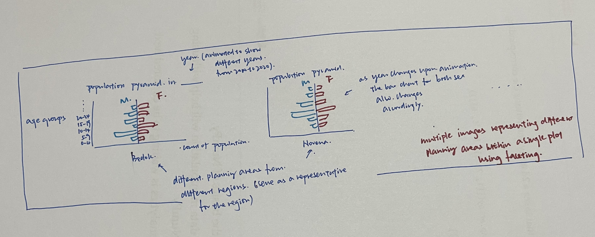

```{r setup, include=FALSE}
knitr::opts_chunk$set(echo = TRUE,
                      fig.retina = 5,
                      warning = FALSE)
```

# 1.0 Introduction
This take-home exercise aims to explore the use of interactivity and animation methods to create an interactive age-sex pyramid based data visualisation with R. By allowing the graphics to be interactive, the changes of demographic structure of Singapore by age cohort and gender at planning area level would be demonstrated clearly to the viewers. 

For this exercise, the data sets used are [*Singapore Residents by Planning Area / Subzone, Age Group, Sex and Type of Dwelling, June 2000-2010 and June 2011-2020*](https://www.singstat.gov.sg/find-data/search-by-theme/population/geographic-distribution/latest-data), which could be downloaded from Department of Statistics home page.

Before processing to the next section, please use the code chunk below to **install and launch the required packages** in RStudio.

```{r}
packages = c('ggiraph', 'plotly', 
             'DT', 'patchwork', 
             'gganimate', 'tidyverse', 
             'readxl', 'gifski', 'gapminder')

for (p in packages){
if (!require(p, character.only = T)){
  install.packages(p)
  }
  library(p,character.only = T)
}
```

# 2.0 Proposed Sketch

To achieve data visualisation at the planning area level, a proposed sketch is created as below.

{height=200%, width=150%}


# 3.0 Data Preparation 
## Importing Data
Using **read_csv()** of readr package, we first read the two sets of data (namely, *Singapore Residents by Planning Area / Subzone, Age Group, Sex and Type of Dwelling, June 2000-2010.csv* and *Singapore Residents by Planning Area / Subzone, Age Group, Sex and Type of Dwelling, June 2011-2020.csv*) used for this exercise into tibbles.

```{r}
population_1 <- read_csv("Data/respopagesextod2000to2010.csv")
population_2 <- read_csv("Data/respopagesextod2011to2020.csv")
tbl_df(population_1)
tbl_df(population_2)

```

## Merging two dataframes
As the both data sets have the same number of columns and the same column names, we could merge the two data sets int one by using **rbind()** fucntion. This function enables the users to stack the two data frames on top of each other, appending the second data frame to the first. 

```{r}
population <-rbind(population_1, population_2)
tbl_df(population)
```

## Wrangling data
### Selecting relevant columns and fixing order
To illustrate the demographic structure change of Singapore by age cohort and gender at planning area level across years, 5 columns would be kept by using **select()** function: Planning Area, Age Group, Sex, Population and Time.
Then, we would preserve order of appearance of the age group (initially ranged from smallest to largest) and fix the order by using **factor()** function.

```{r}
population <- population %>%
  select(PA, AG, Sex, Pop, Time) 

AG_orders <- unique(population$AG)
population$AG <- factor(population$AG, levels = AG_orders, ordered = TRUE)
```

### Computing the population count 
Then data set would be grouped by Planning Area, Age Group, Sex and Time. To compute the total population for each of the group, use **summarise()** to sum up the population count. Then we arrange the data by PA, Age Group and Sex, followed by ungrouping the data for future operations on the grouping variables. 

```{r}
population_sorted <-
  population %>% 
  group_by(PA, AG, Sex, Time) %>% 
  summarise(Count = sum(Pop)) %>%
  arrange(PA, AG, Sex) %>%
  ungroup()
tbl_df(population_sorted)
```
### Selecting records using filter() and logical operator
To better illustrate the demographic change at planning area levels, a sum of five planning areas (Bedok, Clementi, Punggol, Novena and Woodlands) would be selected from five regions respectively (North, North-East, East, West and Central Region) by using **filter()** function.

```{r}
population_filtered <- population_sorted %>%
  filter(PA == "Bedok" |
           PA == "Clementi" |
           PA == "Novena" |
           PA == "Punggol" |
           PA == "Woodlands" )
```

### Modifying signs of population count
Last step is to use **mutate()** function and 'if_else' to modify values in the 'Count' column by changing the signals of males (+) and females (-). This will lead to males at the right side and females at the left side of the plot. 

```{r}
population_filtered <- population_filtered %>%
  mutate(Count = if_else(Sex == 'Males', -Count, Count))
```


# 4.0 Graph Plotting 
## Building static plot using ggplot2
In this case, we use **geom_bar()** again to create a bar with 'Count' column as the initial y-axis. The explanation for the rest of the functions are listed below for your reference:  
**coord_flip()**: to flip the cartesian coordinates so that horizontal becomes vertical, and vertical becomes horizontal.  
**scale_fill_manual()**: to change legend labels and colors.  
**scale_y_continuous()**: to customize the y-axis (which is now at the bottom of the graph) breaks and labels.  
**labs()**：to set x and y-axis labels, add in titles and subtitles.  
**theme_cowplot()**: to set a cowplot theme from cowplot package.  

## Using facet to create multi-panel plots
As our data set comprises of population count from five planning areas, it is helpful to use the **facet()** function to generate small multiples (trellis plots), each displaying a different subset of the data.  
**facet_wrap()**, which wraps a 1d sequence of panels into 2d, is used instead of facet_grid() in this case as it allows a better use of screen space as the displays of the population pyramid are rectangular in shape. *'PA'* serve as the parameter which organise the data into different subplots and the *'n_row'* parameter specifies the number of rows in a facetted plot. 


```{r fig.width=30, fig.height=20}

g <- ggplot(population_filtered, aes(x = AG, y = Count, fill = Sex)) +
  geom_bar(stat = "identity", width = 0.5) +
  coord_flip() +
  scale_y_continuous(n.breaks=12, labels=abs) +
  labs(x = "Age", y = "Population", title = 'Age-Sex Pyramid of Singapore',
       subtitle = 'Year: {closest_state}',
       caption='Source: Singapore Department of Statistics') +
  scale_fill_manual(values=c("darkred", "steelblue"),
                    name='',
                    breaks=c("Males", "Females"),
                    labels=c("Males", "Females")) +
  cowplot::theme_cowplot() + 
  theme(axis.text=element_text(vjust=0.5, size = 8),
        panel.grid.major.y = element_line(color='lightgray',linetype='dashed'),
        legend.position = 'top',
        legend.justification = 'center') +
  facet_wrap(~ PA, nrow = 3) 
```


## Building an interactive data visualisation
To make the age-sex population pyramid more interactive, we could utilise the **transition_states()** function to show the transition between several distinct stages of the data, in this case, the demographic structure change across the years. 
*'Time'* is the column which holds the state levels in the data. The *'transition_length'* parameter is used to indicate the relative length of the transition and it is set to 1 to indicate interval of years. This parameter will be recycled to match the number of states(e.g. years) in the data. The *'state_length'* parameter is the relative length of the pause at the states, which will also be recycled to match the number of years.  
The **enter_*()** and **exit_*()** function are used to define how new data should appear and how old data should disappear during the animated process. The modification type is set to *'fade'* as this would reset alpha(transparency of the bar) to zero, making the elements fade in or out during the transition immediately.  
The **ease_aes()** function defines how different aesthetics should be eased during transitions. For smoother appearance


Last but not least, to animate the graph, the **animate()** function is used to take a gganim object and render it into an animation. The nature of the animation is dependent on the renderer, but defaults to using *gifski* to render it to a **gif**. 
Using various parameters, other details including height and width, fps(number of frames per second), duration (length of the animation), end pause (set rewind = TRUE so that pause at the end for some time and then rewind), res (resolution) could be specified. 


```{r}
g <- g +
  transition_states(Time, transition_length = 1, state_length = 1) +  
  enter_fade() +
  exit_fade() + 
  ease_aes('cubic-in')

animate(g, height = 1000, width = 1000, 
        fps = 20, duration = 15, 
        end_pause = 15, rewind = TRUE, 
        renderer = gifski_renderer('age_sex_pyramid.gif'), res = 100)
```
