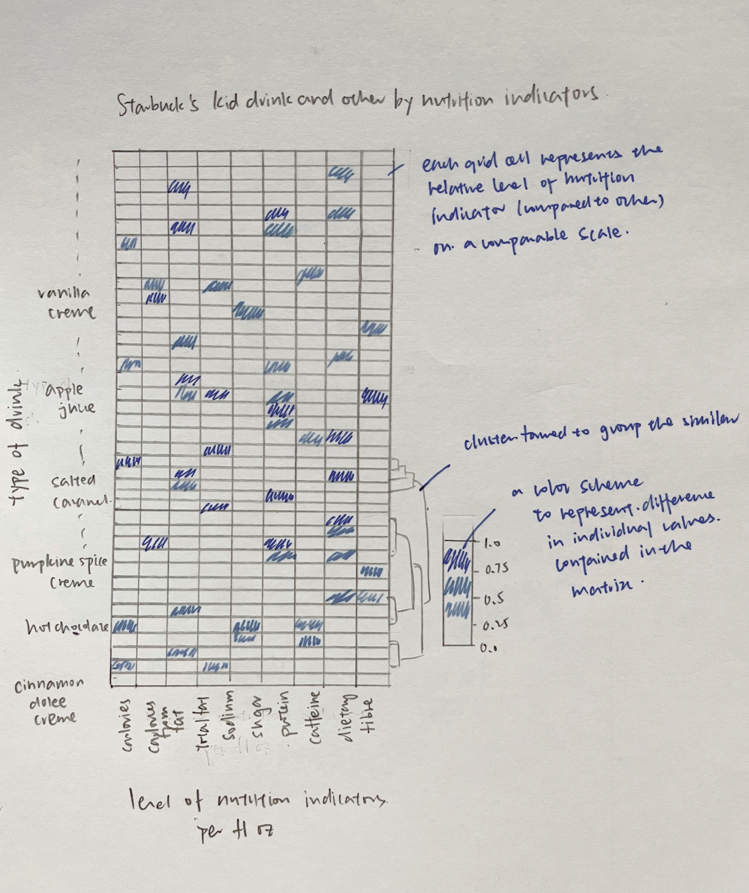
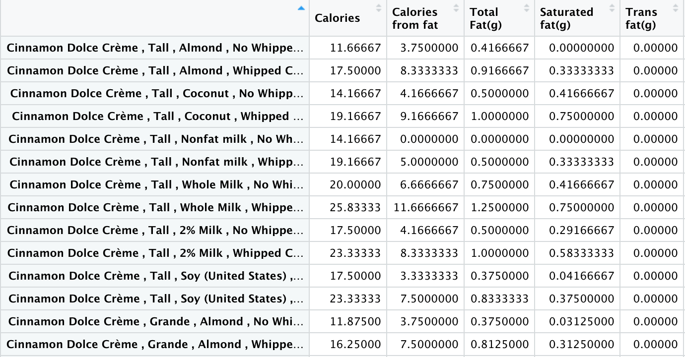

```{r setup, include=FALSE}
knitr::opts_chunk$set(echo = TRUE,
                      fig.retina = 5,
                      warning = FALSE)
```

# 1.0 Introduction
This take-home exercise aims to explore the use of visual analytics techniques and tools to visualise and analyse **multivariate data** with R. Multivariate data analysis is a statistical procedure for analysis of data involving more than two dependent variables. Many problems in the world can be practical examples of multivariate analysis as whatever happens in the world happens due to multiple reasons.   

For this exercise, the data set used is *starbucks_drink.csv*. In order to segment "the kid drink and other" by nutrition indicators, we need to use **heatmap** as it would be able to perform clusterisation and do a corresponding reordering: it would calculate the distance between each pair of rows and columns and try to order them by similarity in terms of level of nutrition indicators. 

## Installing relevant packages 
Before processing to the next section, please use the code chunk below to **install and launch the required packages** in RStudio.

```{r}
packages = c('seriation', 'dendextend', 'heatmaply', 'tidyverse')

for(p in packages){library
  if(!require(p, character.only = T)){
    install.packages(p)
  }
  library(p, character.only = T)
}
```


# 2.0 Proposed Sketch

To achieve data visualisation, a proposed sketch is created as below.

{height=150%, width=80%}


# 3.0 Data Preparation 
## 3.1 Importing Data and Observing data structure
Using ***read_csv()*** of readr package, we first import and save the *starbucks_drink.csv* dataset used for this exercise into into a tibble data frame object called "starbucks".
Then we use ***tbl_df()*** function exhibit the data frame in order to better understand the data structure.  

```{r}
starbucks <- read_csv("Data/starbucks_drink.csv")
tbl_df(starbucks)
```

Through the displayed result, we could observe that most of the columns of nutrition indicators are "dbl", which stands for double class, a double-precision floating point number. Hence, this double confirms that we need to employ techniques and tools for visualising and analysing **multidimensional continuous data** (e.g. nutrition indicators which are on a continuous scale).   

One thing to take notice is that we need to change the datatype of 'Caffeine(mg)' column as it is in "chr" format(character strings) instead of "dbl". This would cause problem in the later stage of the data transformation when we perform division(binary operator) and reordering as character string is non-numeric. Using ***as.numeric()*** function, we would be able to successfully convert 'Caffeine(mg)' column into a numeric column with a data type of "dbl".

```{r}
starbucks$`Caffeine(mg)` <- as.numeric(starbucks$`Caffeine(mg)`)
tbl_df(starbucks)
```

## 3.2 Extracting the target category  
***filter()*** function is then used to filter out the topic of interest, "kid drinks and other" only. 

```{r}
starbucks_kid <- starbucks %>%
  filter(Category == "kids-drinks-and-other")

tbl_df(starbucks_kid)
```

## 3.3 Concatenating columns to differentiate the drink customisation  
It is noticeable that we could not differentiate each row of the table using 'Name' column alone as each type of drink comes with different sizes, choice of milk as well as the option of whether to add whipped cream. Consequently, these choices would affect the level of nutrition indicators in the drink. 

Hence, in order to better differentiate the drink and have an accurate segmentation later, we need to use the ***paste()*** function to concatenate the relevant columns to form a new column 'Drink' to indicate the customisation of buyer when ordering drink at Starbucks. 

```{r}
starbucks_kid$Drink <- paste(starbucks_kid$Name, ",", 
                             starbucks_kid$Size, ",",  starbucks_kid$Milk, ",",
                             starbucks_kid$`Whipped Cream`)
```

## 3.4 Computing level of nutrition indicators per unit of volume
To have a fair comparison, we need to compute the level of nutrition indicators based on the size(e.g. the 'Portion' column) of the drink instead of using the absolute number, as in most cases, larger volume would have higher nutrition level. To calculate the nutrition level *per fluid ounce (fl oz)*, ***function()*** is used as the step of "divide.by.volume" need to be performed on multiple columns.  

Next, ***mutate_if()*** function is used to edit specific columns with the predicate function. It only affects the columns that satisfy the if statement. In this case, the condition to filter the columns would be to check whether the datatype of the column is "dbl" (double class), as we have converted all the 'nutrition level' columns into numeric values. 

```{r}

divide.by.volume <- function(x, na.rm=FALSE) (x/starbucks_kid$`Portion(fl oz)`)
starbucks_kid <- starbucks_kid %>% 
  mutate_if(is.double, divide.by.volume)
tbl_df(starbucks_kid)
```
## 3.5 Preparing the data
Before transforming the data frame into a matrix, ***select()*** function is used to only keep the drink type and their respective nutrition levels. Then, we use the ***row.names()*** function to replace the row numbers by "drink type". 

```{r}
starbucks_filtered <- dplyr::select(starbucks_kid, c(4:15,19))
row.names(starbucks_filtered) <- starbucks_filtered$Drink
```

## 3.6 Transforming the data frame into a matrix
Before the final step of plotting, we need to use ***data.matrix()*** function to transform the data frame into a "data matrix" format. From the 

```{r}
starbucks_matrix <- data.matrix(starbucks_filtered)
```

From the matrix, we can see that the row numbers have been replaced by types of drink.

{height=50%, width=80%}

## 4.0 Creating Interactive Heatmap
In this section, we would use the **heatmaply** package to design an interactive cluster heatmap to segment the drinks by nutrition indicators. 

## 4.1 Data transformation using percentilsing method
Through observation, we could see that the almost all the "nutrition level" columns have different units of measurement as well as value ranges. Hence, we need to make sure all these variables have comparable values before effective clustering. To achieve this, we could use several data transformation methods: scale, normalise and percentilse.  

For this exercise, we would use the **percentilse** method as this method allows the variables to be comparable on the same "scale" and the value represented by each grid cell has a relatively clear interpretation: the percent of observations that got that value or below it.
"-c()" is used to exclude the irrelevant columns (by using the column no.) in the matrix when plotting the heatmap. 

```{r}
heatmaply(percentize(starbucks_matrix[, -c(13)]))
```

## 4.2 Clustering algorithm using statistical approach 
To determine the best clustering method and number of clusters, the *dend_expend()* and *find_k()* functions of **dendextend** package will be used. Using a statistical approach, we could determine the clustering model by selecting the recommended clustering method and the number of clusters. 

Firstly, the ***dend_expend()*** function is used to select the most appropriate clustering method to be used, which is determined by the highest optimum value.

```{r}
starbucks_d <- dist(percentize(starbucks_matrix[, -c(13)]), method = "euclidean")
dend_expend(starbucks_d)[[3]]
```

From the result, we could see that **"average"** method should be used as it has the highest optimum value of 0.649. 

Next, the ***find_k()*** function is used to determine the optimal number of clusters.

```{r}
starbucks_clust <- hclust(starbucks_d, method = "average")
num_k <- find_k(starbucks_clust)
plot(num_k)
```
From the graph, we could see that the optimum number of clusters(k) is **10**. 

With this, we could plot out a basic cluster heatmap. 

```{r}
heatmaply(normalize(starbucks_matrix[, -c(13)]),
          dist_method = "euclidean",
          hclust_method = "average",
          k_row = 10)
```

## 4.3 Seriation
To find the optimal ordering of rows and columns, **seriation** package of heatmaply is used. The optimal ordering would optimize the Hamiltonian path length, that is restricted by the dendrogram structure. Hence, this ordering would ensure the sum of distances between each adjacent leaf (label) will be minimized. A few seriation algorithms could be used: Optimal Leaf Ordering (OLO), Gruvaeus and Wainer (GW), Mean and None. 
For this exercise, we would use the OLO method to minimize the sum of dissimilarities between adjacent leaves. 


## 4.4 Setting the colour palette 
The default colour palette used by heatmaply is viridis. However, this palette is a bit distracting for this data set due to the large number of records involved. To improve the aestheticness and visual friendliness of the heatmap, we would use the "blues" colour palette of rColorBrewer. 

```{r}
heatmaply(normalize(starbucks_matrix[, -c(13)]),
          seriate = "OLO",
          colors = Blues)
```

## 4.5 Final Modification 
Besides the abovementioned functions, **heatmaply** also provides basic plotting features to enhance the cartographic quality of the heatmap plotted. Some of the commonly used arguments would be:   

*margins*: to change the margins of the plot.  
*fontsizw_row* and *fontsize_col*: to change the font size for row and column labels.  
*main*: to write the main title of the plot.  
*xlab* and *ylab*: to write the x-axis and y-axis labels respectively.  

```{r}

heatmaply(normalize(starbucks_matrix[, -c(13)]),
          Colv=NA,
          seriate = "OLO",
          colors = Blues,
          k_row = 10,
          margins = c(NA,200,60,NA),
          fontsize_row = 4,
          fontsize_col = 5,
          main = "Segmentation of kid_drinks_and_other by nutrition indicators",
          xlab = "Level of Nutrition Indicators per fl oz",
          ylab = "Type of Drink"
          ) %>% layout(width=800, height=1000)
```
From the coloring of cluster on the right side of heatmap, we would be able to the segmentation of "kid drinks and other" by level of nutrition indicators. 

## 5.0 Comparison between Tableau and R
Tableau have limited tools in handling multivariate data analysis whereas R could be used to visualise and analyse multidimensional continuous and categorical data through several techniques:

* To reveal the pair-relationship between multiple variables: scatterplot matrix, correlogram
* To compare the feature of several individual observations on a set of numeric variables: heatmap, parallel coordinates plot

